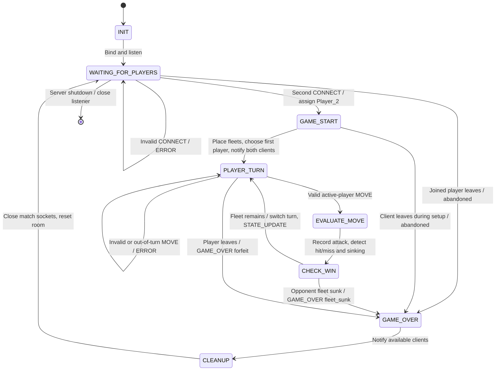

# CommandFleet server state machine

**Author:** Madison Wacaser  
**Related document:** `protocol_blueprint.md`

The server is authoritative for two players' boards, attack histories, and active turn. It runs one match at a time and may run several matches sequentially without restarting. `GAME_START`, `EVALUATE_MOVE`, and `CHECK_WIN` are brief internal processing states; client commands received during them remain queued until the server finishes processing the current event. A rejected move retains the active turn.

## State and transition rules

| State | Server behavior | Events and next state |
| --- | --- | --- |
| `INIT` | Create room state, bind TCP port 45700, listen. | Successful setup → `WAITING_FOR_PLAYERS`; unrecoverable bind error → close resources and exit. |
| `WAITING_FOR_PLAYERS` | Accept a `CONNECT`, assign ID based on successful join order; send first player `LOBBY_WAIT`. Reject bad aliases and third joins. | Second valid `CONNECT` → assign `Player_2`, then enter `GAME_START`. `MOVE` before start → `ERROR NOT_READY`, remain. First player exits → `GAME_OVER` (`abandoned`). |
| `GAME_START` | Generate new independent fleets, choose first player randomly, send each player its own `GAME_START` and initial `STATE_UPDATE`. | When setup succeeds → `PLAYER_TURN`. If a player leaves before both receive start notification → `GAME_OVER` (`abandoned`, no winner). Do not accept moves until setup finishes. |
| `PLAYER_TURN` | Wait for messages from either socket; only `active_player` may attack. | Malformed request → `ERROR INVALID_SCHEMA`; wrong player → `NOT_YOUR_TURN`; invalid coordinate → `INVALID_COORDINATE`; repeated coordinate → `ALREADY_ATTACKED`. For these, remain in `PLAYER_TURN` without changing state or turn. Valid active move → `EVALUATE_MOVE`. Disconnect/EOF/socket failure → `GAME_OVER` (`forfeit`). |
| `EVALUATE_MOVE` | Apply exactly one accepted attack; mark hit or miss, detect if a particular ship sank, record `last_move`. | Always → `CHECK_WIN`. |
| `CHECK_WIN` | Check whether opponent has zero unhit ship cells. | If zero → `GAME_OVER` (`fleet_sunk`, attacker wins). Otherwise change active player, send each recipient its own `STATE_UPDATE`, then → `PLAYER_TURN`. |
| `GAME_OVER` | Set terminal result and winner. Send recipient-specific `GAME_OVER` to clients still reachable; failed sends do not reverse the result. | After notification attempt → `CLEANUP`. |
| `CLEANUP` | Close both match client sockets; clear aliases, IDs, fleets, attack histories, active turn, and result. Keep the listening socket open. | Return to `WAITING_FOR_PLAYERS` with an empty room. On explicit server shutdown, close the listening socket and exit instead. |

An orderly `DISCONNECT`, TCP EOF (`recv()` returns `b""`), a reset, a broken pipe, and a configured socket timeout all trigger the leave transition. Departure before setup finishes produces `abandoned` with `winner=null` and `final_state=null`. In a started game, the remaining player wins by forfeit; this records an **incomplete fleet game**, distinct from a `fleet_sunk` victory. If both clients become unreachable, cleanup still happens, but no notification is guaranteed. Validate the JSON framing and schema before dispatching a message into the FSM. A parser error on one client sends `ERROR` when feasible; a framing limit violation closes that connection and follows the corresponding leave transition. A new match starts only after cleanup returns to the empty lobby.

## State invariants

1. No ship placement, active turn, or board update is sent until two valid clients have joined and `GAME_START` begins.
2. Exactly one player is active in `PLAYER_TURN`; invalid moves never consume that player's turn.
3. Each `(row, col)` can be accepted at most once per attacking player.
4. Server state is authoritative; each outgoing board view is computed for its recipient and hides unhit opposing ships.
5. A match ends immediately when the last opposing ship cell is hit, before another turn is assigned.
6. `GAME_OVER` is terminal **for that match**. A socket failure during notification leads to cleanup, never another turn in the finished match. All match state is cleared before new players join.
